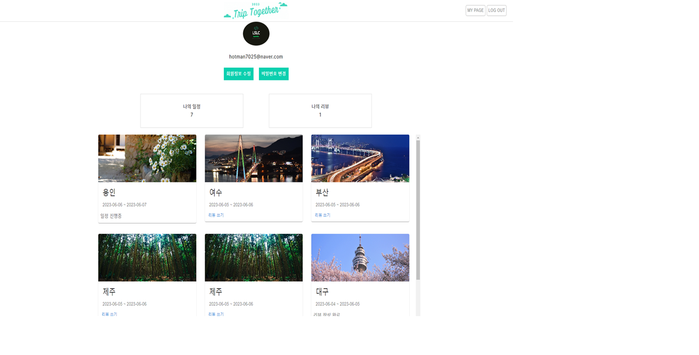

# 여행 경로 추천 사이트

## 1. 프로젝트 소개

## 라이브러리
- Jdk 11 
- Spring Boot 2.6.6
- Spring Security
- Spring Aop
- MySQL 8 
- Mybatis 2.2.2 
- Lombok
- Maven

## tools
- IntelliJ IDEA
- Spring tool suite 4
- MySQL Workbench
- Postman
- Git
- SourceTree
- GitKraken

## 흐름도

## Class Diagram

## ERD

## 주요 기능( 로그인 )

## 주요 화면 소개

- 홈 화면 소개
- 로그인 화면 소개
- 회원가입 화면 소개
- 마이페이지 소개
- 여행저장페이지 소개
- 여행 리뷰페이지 소개

### 홈 화면

- 해당 화면의 경우 유저가 많이 여행을 간 순위대로 나오게됩니다.

- 해당화면의 경우 가고 싶은 여행지를 선택가능

- 여행지 클릭시 화면

### 로그인 화면

- 로그인 과정입니다.

### 회원가입

- 회원가입에 관한 페이지입니다.

### 마이페이지

- 저장된 나의여행 화면과 리뷰들 화면

 
 

### 여행저장페이지

- 여행저장에 관한 페이지입니다.

 

### 여행리뷰페이지

- 여행리뷰에 관한 페이지입니다.

 
 
